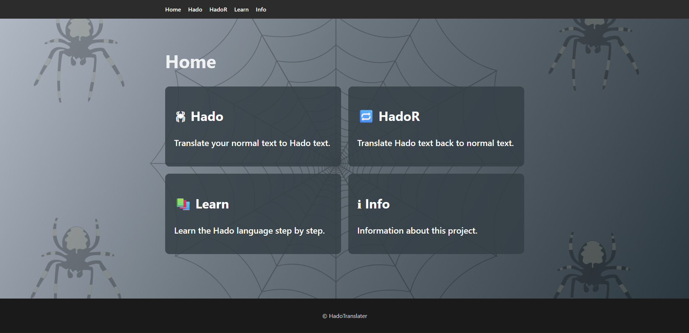
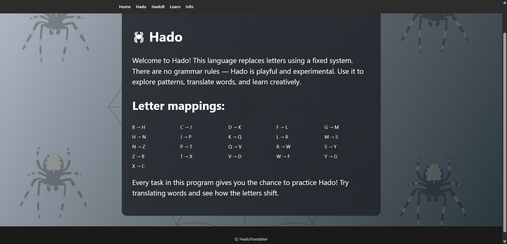
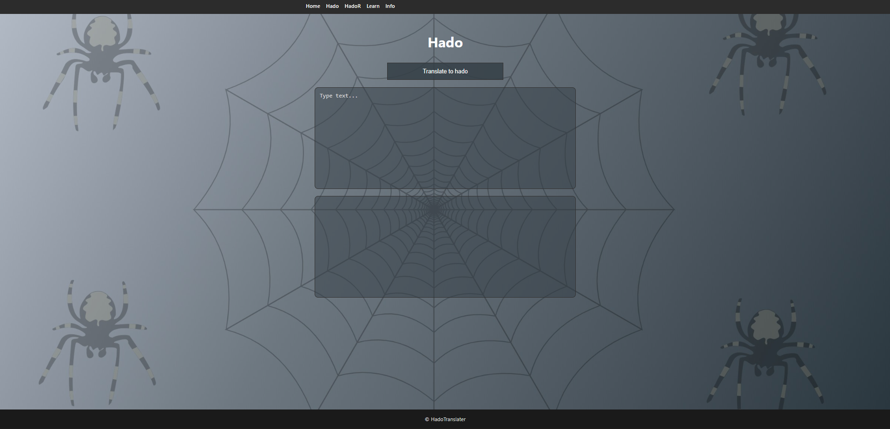
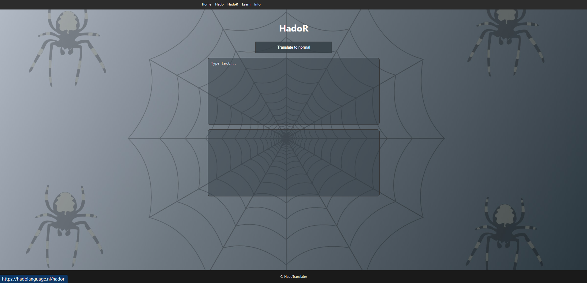

# 🕷️ WebSpider – Hado Translator 🕸️

---

### Brief explanation

In my WebSpider project, I am creating a **web-based translator** for my own language called **Hado** (not a programming language).

The goal of this project is to build a modern **full-stack web application** where users can translate text between their own language and Hado.

While working on this project, I am exploring and learning new technologies such as **Java (Java 25)**, **Spring Boot**, **React**, and **MariaDB**.  
Because I am still learning, this project helps me experiment with new concepts and technologies that I have not worked with before.

## 🛠 Technologies Used

### Tech Stack

| Java                                                                               | Spring Boot                                                                              | React                                                                                 | Maven                                                                                 | MariaDB                                                                                     | HTML                                                                                 | CSS                                                                               | JavaScript                                                                                           |
|------------------------------------------------------------------------------------|------------------------------------------------------------------------------------------|---------------------------------------------------------------------------------------|---------------------------------------------------------------------------------------|---------------------------------------------------------------------------------------------|--------------------------------------------------------------------------------------|-----------------------------------------------------------------------------------|------------------------------------------------------------------------------------------------------|
|  |  |  |  |  |  |  |  |
---

#### Home screen

On the home screen there are sort of small
explanations of what each screen does (besides the home, login screens).

---
#### Info screen
here is information about the hado language

---
#### Hado screen
the hado screen translates any language to hado language, but for example, English hado is different from Dutch hado

#### HadoR screen
the hadoR screen will translate any hado language back to which language it translates

### what I'm still working on

- Small bugs
- learn Screen

---

### ideas that are coming

---

### link to app variant
https://github.com/Outlaw23/Translator
### link to hado language website
https://hadolanguage.nl/public

